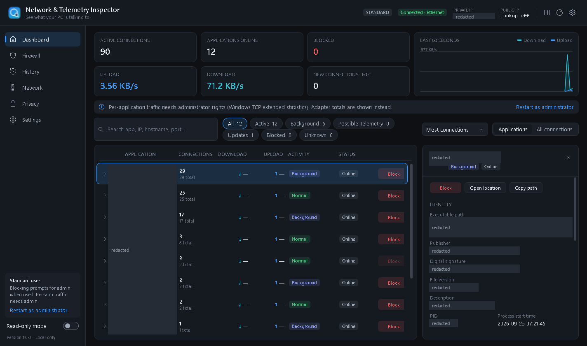
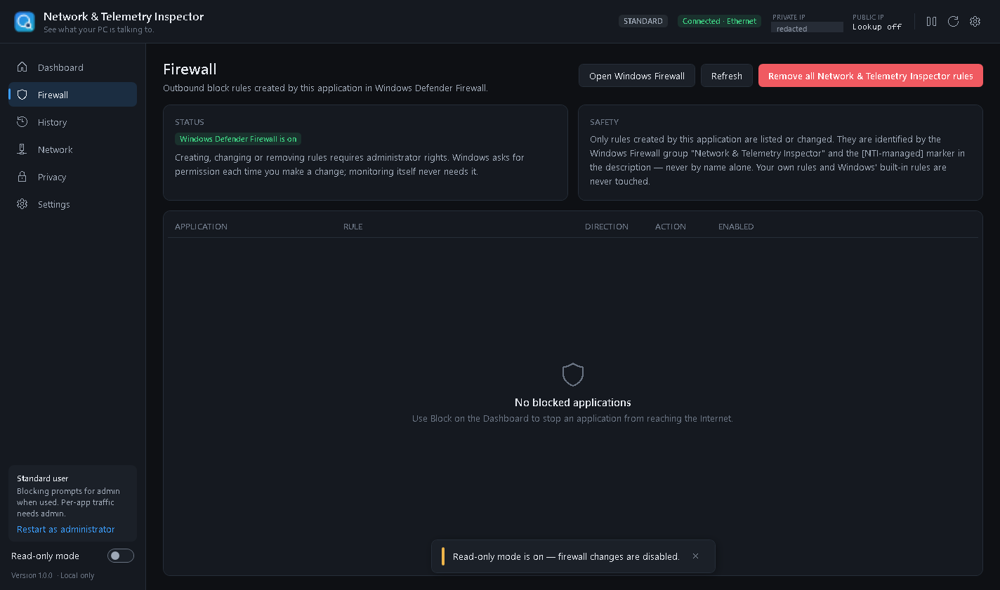
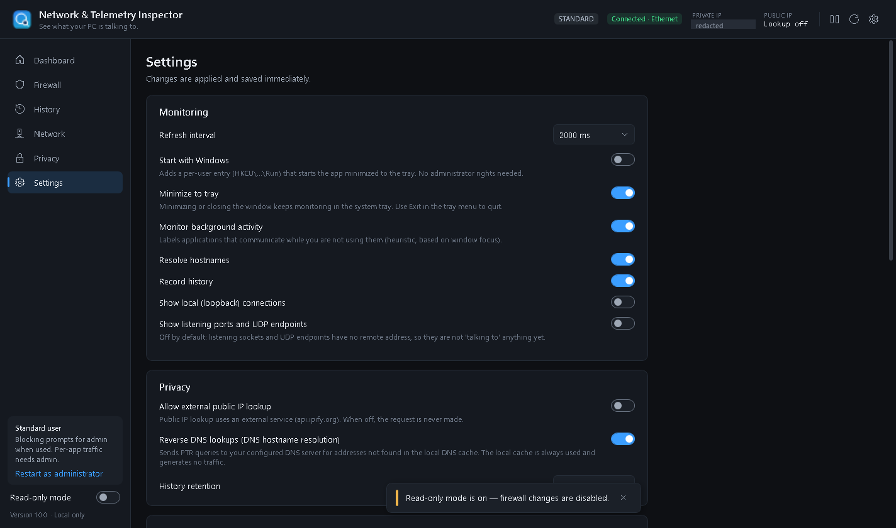

# Network & Telemetry Inspector

**See what your PC is talking to.**

A local, privacy-first Windows app for monitoring network activity and managing firewall blocks. It shows which applications are talking to the network right now, where they connect to, and whether they do it in the background. You can block any of them with two clicks in Windows Defender Firewall, and unblock them just as quickly.



## Download

Get **`NetworkTelemetryInspector.exe`** from [Releases](https://github.com/unupunct/NetworkTelemetryInspector/releases).
It's a single portable file (Windows 10/11 x64). It needs no installer and no .NET runtime. Copy it anywhere and run it.

> The executable is not code-signed, so Windows SmartScreen may warn the first time you run it.
> `SHA256SUMS.txt` in the release lets you check the download.

## Features

| Area | What it does |
| --- | --- |
| **Live connections** | Reads every TCP connection (IPv4 and IPv6) with its owning process, straight from Windows (`GetExtendedTcpTable`). No `netstat` is spawned. Refreshes every 1–10 s. |
| **Grouped by application** | 30 Chrome sockets show up as one expandable *chrome.exe* row, with the app's icon, connection count, traffic and last-seen time. There's also a flat **All connections** grid with every column. |
| **Process identity** | Shows the path, publisher, file version, start time, hosted Windows services (for `svchost.exe`) and the **Authenticode signature**, embedded or catalog-signed. It also works for SYSTEM services a standard user can't open. |
| **Hostnames** | Hostnames come first from the local **DNS client cache**, i.e. the name the PC actually looked up. No traffic is sent for that. Otherwise the app falls back to a throttled, cached reverse DNS lookup, which you can turn off. |
| **Background activity labels** | *Normal*, *Background*, *Possible Telemetry*, *Update Service* and *Unknown*. Each label shows the evidence behind it. The labels are heuristics, not verdicts (see below). |
| **Two-click blocking** | **Block** → confirm → Windows creates an outbound Windows Defender Firewall rule for that executable. **Unblock** removes it. A blocked app's connection attempts appear on its timeline. |
| **Firewall page** | Lists the rules this app created, with Enable, Disable, Delete and Unblock. **Remove all Network & Telemetry Inspector rules** clears them in one go. |
| **History** | A local log of connections opened and closed, blocks and unblocks. You can filter it by app, IP, hostname, date, status and protocol, export it to CSV, or clear it. |
| **Live graph** | Download and upload over the last 60 seconds. |
| **Search & quick filters** | Search instantly across apps, IPs, hostnames, ports and publishers. Quick filters: All / Active / Background / Possible Telemetry / Updates / Blocked / Unknown. |
| **Network page** | Shows each adapter's type (Ethernet / Wi-Fi / VPN), IPv4 and IPv6 addresses, gateway, DNS servers, link speed and MAC. The primary adapter is the one Windows routes Internet traffic through. |
| **Read-only mode** | Monitoring only: the app makes no firewall or system changes. A header badge shows it. |
| **Tray, notifications, autostart** | Runs in the tray with Open, Pause and Resume, Read-only mode and Exit. It can show optional Windows notifications and start with Windows through a per-user Run key. |
| **Dark / Light / Follow Windows** | |

| Firewall | Settings |
| --- | --- |
|  |  |

*The private IP address in the screenshots is redacted.*

## Privacy

Network & Telemetry Inspector **does not collect or upload your network activity**. It has no accounts, no cloud backend, no analytics, no ads and no telemetry of its own. All settings, history and logs stay in `%LOCALAPPDATA%\NetworkTelemetryInspector`.

The only outbound requests it can make:

* **Public IP lookup** (optional, on by default): a plain HTTPS GET to `api.ipify.org` that sends nothing else. Turn it off in Settings and the request is never made.
* **Reverse DNS** (optional): PTR queries to *your own* configured DNS server, for IPs that aren't in the local DNS cache.

Signature checks run offline. Revocation checking is off and certificate retrieval uses only the local cache.

## Safety model

* **Least privilege.** The app runs as a standard user (`asInvoker`). A firewall change relaunches the same exe elevated for **one** operation, and UAC asks each time. The request goes through a small file in the app's own data folder, and only a fixed GUID is put on the command line. The elevated side checks everything again: the operation must be an enum value, and the path must be a fully qualified, existing, local `.exe`.
* **Only its own rules.** Every rule is named `NTI_BLOCK_<App>_<PathHash>`. A rule counts as the app's only when it is in the firewall group `Network & Telemetry Inspector` **and** its description carries the `[NTI-managed]` marker. A name alone never counts. Your own rules and Windows' built-in rules are never changed or deleted.
* **Refuses to break Windows.** `svchost.exe`, `lsass.exe`, `services.exe`, `csrss.exe`, `wininit.exe`, `smss.exe` and `winlogon.exe` can't be blocked, and the app explains why.
* The app doesn't intercept, capture or decrypt traffic, and it doesn't touch Defender or any other security setting.

## Limitations

* **Telemetry labels are heuristic.** The app sees metadata only: the process, the destination IP and port, the hostname when available, and the connection state. It can't tell what an encrypted (HTTPS) connection carries. *Possible Telemetry* means a hostname, process or service matched an editable pattern list (`classification-rules.json`). It does **not** prove that the connection is telemetry.
* **Per-application upload and download need administrator rights.** They come from Windows TCP Extended Statistics, and turning those on needs admin. As a standard user the app shows machine-wide adapter throughput and marks per-app values as unavailable. It never estimates them. Use *Restart as administrator* if you want per-app figures.
* **UDP** can't be tied to a remote address, and Windows has no per-process UDP counters. UDP endpoints appear only when *Show listening ports and UDP endpoints* is on.
* Connections that open and close between two refreshes can be missed.
* A *blocked attempt* is a blocked app's connection stuck in `SYN_SENT`. The app doesn't read Windows Firewall's own drop log, because turning that log on would mean changing a security setting.
* Protected processes that hide their image from Windows appear as **Unknown Process** and can't be blocked.
* Classification of the Background label relies on window focus. An app counts as background when it has no visible window, or hasn't been in the foreground for 2 minutes.

## Measured on a real machine (Windows 11, 16 logical CPUs, standard user)

| Check | Result |
| --- | --- |
| Steady-state CPU with the full UI running and monitoring at 2 s | **0.15 %** of the machine (2.4 % of one core) |
| Memory (private working set, as shown in Task Manager) | **~70 MB**; live managed heap 13 MB |
| One monitoring cycle, about 70 connections | 2–15 ms |
| End-to-end workflow: launch → detect → inspect → Block → verify the rule → traffic really blocked → Unblock → rule removed → traffic restored | **Pass**, through the real UAC helper |

## Running from source

Requires the .NET 8 SDK on Windows.

```powershell
dotnet run --project src\NetworkTelemetryInspector
```

Build the single-file release (`release\NetworkTelemetryInspector.exe`, self-contained, win-x64, ReadyToRun):

```powershell
powershell -ExecutionPolicy Bypass -File scripts\publish.ps1
```

Verification. None of these take screenshots of your desktop; the UI is rendered off screen:

```powershell
scripts\test.ps1            # 58 unit tests + engine self-test + UI verification (no admin needed)
scripts\workflow-test.ps1   # Block/Unblock end to end on a private copy of curl.exe (2 UAC prompts)
```

The exe also has headless modes: `--selftest`, `--verify-ui [--shots dir]`, `--measure <seconds>`, `--workflow-test --target <exe>`, and `--uninstall`. The last one removes the app's firewall rules, the autostart entry and all local data.

### Project layout

```
src/NetworkTelemetryInspector/
  Network/     connection table (iphlpapi), TCP ESTATS traffic, DNS cache, hostname resolver, adapters, monitor engine
  Process/     process identity, kernel process table, Authenticode (embedded + catalog), window focus
  Firewall/    rule naming/ownership, COM firewall operations, elevated one-shot helper, service facade
  Services/    settings, classification rules + classifier, history store
  ViewModels/  MVVM (CommunityToolkit.Mvvm)
  Views/       WPF pages; Resources/ holds the theme and styles; Controls/ holds the graph and badges
tests/         dependency-free test harness
scripts/       publish, test, workflow test, icon generator
```

## License

MIT. See [LICENSE](LICENSE).
